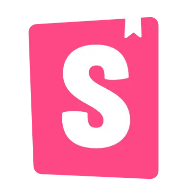
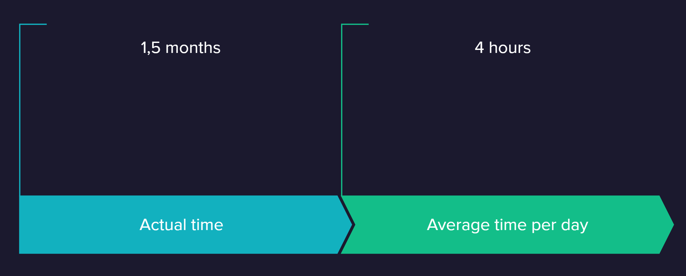
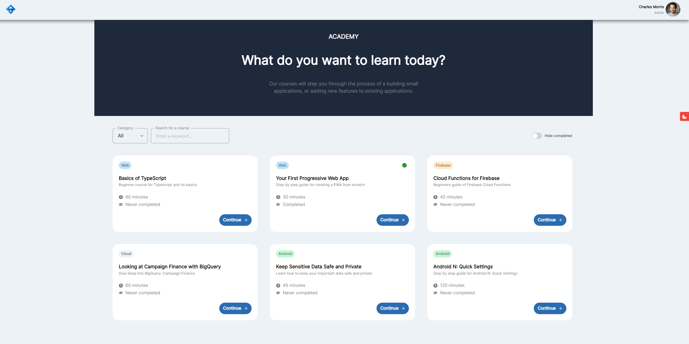
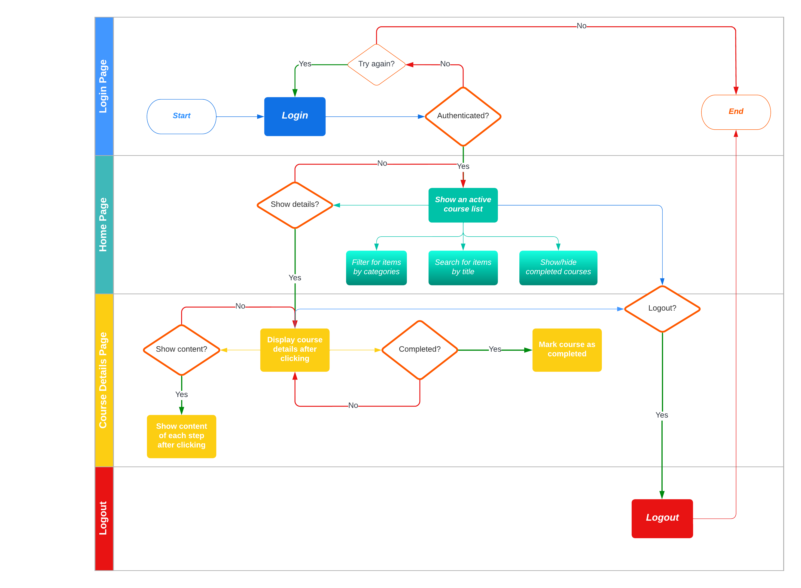
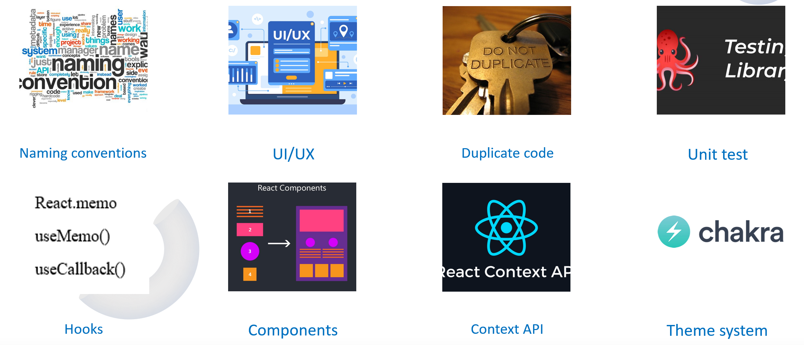

---
# try also 'default' to start simple
theme: seriph
# random image from a curated Unsplash collection by Anthony
# like them? see https://unsplash.com/collections/94734566/slidev
background: https://source.unsplash.com/1600x900/?nature,water
# apply any windi css classes to the current slide
class: 'text-center'
# https://sli.dev/custom/highlighters.html
highlighter: shiki
# show line numbers in code blocks
lineNumbers: false
# some information about the slides, markdown enabled
info: |
  ## Presentation slides for React Practice 2
# persist drawings in exports and build
drawings:
  persist: false
# use UnoCSS
css: unocss
# font
fonts:
  # basically the text
  sans: 'Nunito'
  # use with `font-serif` css class from windicss
  serif: 'Nunito'
  # for code blocks, inline code, etc.
  mono: 'Fira Code'
---


# Course management application

<div class="pt-12">
  <p>Mentor: ni.ngo</p>
  <p>Supporter: nhung.duong</p>
</div>

<div class="abs-br m-6 flex gap-2">  
  <p color='gray' >Nov 24th, 2022</p>
  <a href="https://gitlab.asoft-python.com/uyen.ho/react-training/-/tree/feature/practice-two/course-management" target="_blank" alt="GitLab"
    class="text-xl icon-btn opacity-50 !border-none !hover:text-white">
    <svg width="32" height="32" viewBox="0 0 16 16"><path fill="currentColor" fill-rule="evenodd" d="m14.329 6.922l-.02-.053l-1.239-3.232l-.668 2.044l-.337 1.035H3.936L3.598 5.68l-.667-2.043l-1.24 3.237l-.005.01l-.004.01l-.018.045a2.543 2.543 0 0 0 .848 2.93l.005.004l.01.008l.01.008l.009.006l3.302 2.474l.004.004l1.644 1.242l.5.379l.501-.379l1.644-1.242l.006-.004l3.325-2.489l.007-.005l.009-.007a2.543 2.543 0 0 0 .844-2.939l-.003-.008Zm.053 4.152l-3.337 2.497l-1.643 1.242l-.999.755a.675.675 0 0 1-.813 0l-.999-.755l-1.643-1.242l-3.313-2.483l-.018-.014l-.008-.006A4.043 4.043 0 0 1 .267 6.395l.023-.057l1.9-4.963l.013-.033l.081-.212l.023-.06l.158-.413A.565.565 0 0 1 2.941.3a.576.576 0 0 1 .613.415l.134.41l.005.017l.078.239l.011.033l1.242 3.802h5.953l1.241-3.802l.011-.033l.078-.24l.006-.016l.133-.41a.575.575 0 0 1 1.088-.058l.157.409l.025.064l.08.211l.013.033l1.903 4.963l.022.058a4.043 4.043 0 0 1-1.343 4.671l-.01.008Z" clip-rule="evenodd"/></svg>
  </a>
</div>

---
layout: image-right
image: 'image/agenda.jpg'
---

# Agenda

1. Target
   
2. Techniques
   
3. Timeline
   
4. Features
   
5. Workflow
   
6. Demo
   
7. Issues
   
8. Things need to improve
   
9. Q&A

<style>
h1 {
  background-color: #2B6CB0;
  background-image: linear-gradient(45deg, #63B3ED 10%, #2B6CB0 20%);
  background-size: 100%;
  -webkit-background-clip: text;
  -moz-background-clip: text;
  -webkit-text-fill-color: transparent;
  -moz-text-fill-color: transparent;
}
</style>

---
layout: image-left
image: 'image/target.jpg'
---

# Target

```ts {1|2|3|4|all}
- Fetching data with SWR
- Apply code splitting, storybook
- Apply useContext and useReducer for state management
- Unit test coverage should be greater than 80%
```

<style>
h1 {
  background-color: #2B6CB0;
  background-image: linear-gradient(45deg, #63B3ED 10%, #2B6CB0 20%);
  background-size: 100%;
  -webkit-background-clip: text;
  -moz-background-clip: text;
  -webkit-text-fill-color: transparent;
  -moz-text-fill-color: transparent;
}
</style>

---

# Techniques

<div grid="~ cols-3 gap-4">

<div>

- React 18.2
  
- Vite
  
- TypeScript
  
- Jest
  
- React Testing Library
  
- SWR
  
- Mock API

- Storybook
  
- Chakra UI
  
</div>

<div ml-20>


</div>

<div ml-5>


</div>

</div>

<style>
h1 {
  background-color: #2B6CB0;
  background-image: linear-gradient(45deg, #63B3ED 10%, #2B6CB0 20%);
  background-size: 100%;
  -webkit-background-clip: text;
  -moz-background-clip: text;
  -webkit-text-fill-color: transparent;
  -moz-text-fill-color: transparent;
}
</style>

---

# Timeline



<style>
h1 {
  background-color: #2B6CB0;
  background-image: linear-gradient(45deg, #63B3ED 10%, #2B6CB0 20%);
  background-size: 100%;
  -webkit-background-clip: text;
  -moz-background-clip: text;
  -webkit-text-fill-color: transparent;
  -moz-text-fill-color: transparent;
}
</style>

---

# Features

<div grid="~ cols-2 gap-4" mt-10>
<div>
<h4 py-2>Build a course management application:</h4>
 
</div>

- User can login, logout
- User can see list of courses
- User can see course details
- User can filter courses by category
- User can search courses by title
- User can show/hide completed courses
- User can complete courses

</div>

<style>
h1 {
  background-color: #2B6CB0;
  background-image: linear-gradient(45deg, #63B3ED 10%, #2B6CB0 20%);
  background-size: 100%;
  -webkit-background-clip: text;
  -moz-background-clip: text;
  -webkit-text-fill-color: transparent;
  -moz-text-fill-color: transparent;
}

h4 {
  background-color: #ED64A6;
  background-image: linear-gradient(45deg, #F687B3 10%, #ED64A6 20%, #D53F8C 50%);
  background-size: 100%;
  -webkit-background-clip: text;
  -moz-background-clip: text;
  -webkit-text-fill-color: transparent;
  -moz-text-fill-color: transparent;
}
</style>

---

# [Workflow](https://gitlab.asoft-python.com/uyen.ho/react-training/-/raw/feature/practice-two/course-management/src/assets/images/workflow.png)



<style>
h1 {
  text-align: center;
  background-color: #2B6CB0;
  background-image: linear-gradient(45deg, #63B3ED 10%, #2B6CB0 20%);
  background-size: 100%;
  -webkit-background-clip: text;
  -moz-background-clip: text;
  -webkit-text-fill-color: transparent;
  -moz-text-fill-color: transparent;
}
</style>

---

# Demo


<style>
h1 {
  background-color: #2B6CB0;
  background-image: linear-gradient(45deg, #63B3ED 10%, #2B6CB0 20%);
  background-size: 100%;
  -webkit-background-clip: text;
  -moz-background-clip: text;
  -webkit-text-fill-color: transparent;
  -moz-text-fill-color: transparent;
}
</style>

---
layout: image-right
image: 'image/issues.jpg'
---

# Issues

<div
  v-if="$slidev.nav.currentPage === 9"
  v-motion
  :initial="{ x:0, y: 40, opacity: 0}"
  :enter="{ y: 0, opacity: 1, transition: { delay: 300 } }">

```html
- Confuse usage of hooks to prevent re-render
- Basic test with jest & react-testing-library
- Define a system of theme in Chakra
```
</div>

<style>
h1 {
  background-color: #2B6CB0;
  background-image: linear-gradient(45deg, #63B3ED 10%, #2B6CB0 20%);
  background-size: 100%;
  -webkit-background-clip: text;
  -moz-background-clip: text;
  -webkit-text-fill-color: transparent;
  -moz-text-fill-color: transparent;
}
</style>

---

# Things need to improve

<div
  v-if="$slidev.nav.currentPage === 10"
  v-motion
  :initial="{ x: -80, opacity: 0}"
  :enter="{ x: 0, opacity: 1, transition: { delay: 500, duration: 1000 } }">    
  
</div>


<style>
h1 {
  background-color: #2B6CB0;
  background-image: linear-gradient(45deg, #63B3ED 10%, #2B6CB0 20%);
  background-size: 100%;
  -webkit-background-clip: text;
  -moz-background-clip: text;
  -webkit-text-fill-color: transparent;
  -moz-text-fill-color: transparent;
}
</style>

---
layout: image
image: 'image/q&a.jpg'
---

# Q&A

<style>
h1 {
  padding-top: 20%;
  padding-left: 30%;
  background-color: #63B3ED;
  font-size: 10em;
  -webkit-background-clip: text;
  -moz-background-clip: text;
  -webkit-text-fill-color: transparent;
  -moz-text-fill-color: transparent;
}
</style>

---
layout: image
image: 'image/thanks.jpg'
---
